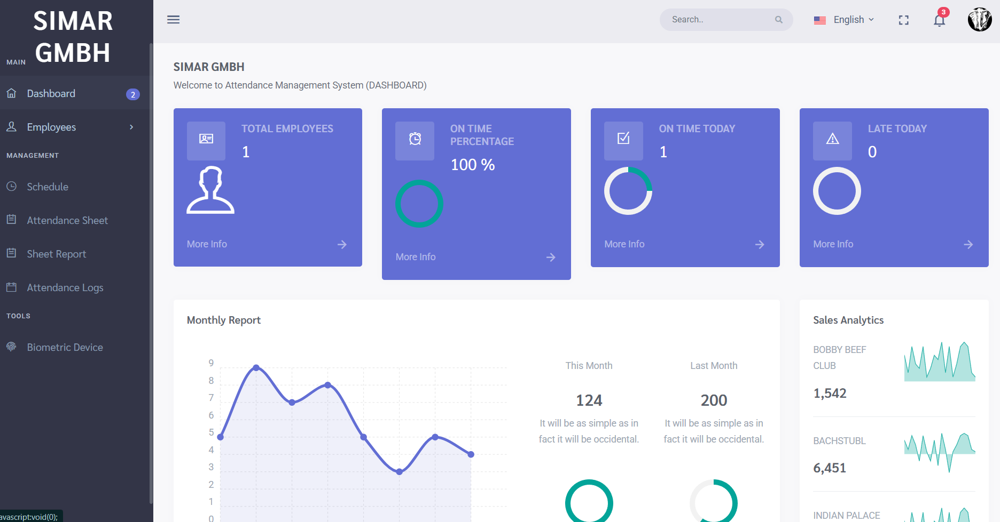
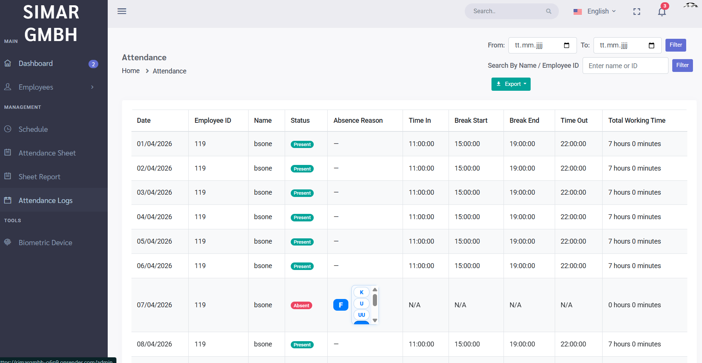

# 📊 Attendance Management System - SIMAR GmbH

A comprehensive, modern **Attendance Management System** built with Laravel 11, featuring real-time attendance tracking, employee management, payroll integration, and advanced reporting capabilities.

## ✨ Key Features

### 📅 Attendance Management
- **Daily Attendance Logging**: Real-time check-in/check-out with timestamp tracking
- **Date Range Filtering**: Filter attendance by custom date ranges
- **Employee Search**: Search by name or employee ID with instant filters
- **Absence Tracking**: Track absences with configurable reason codes
- **Working Hours Calculation**: Automatic calculation of working hours with break deductions
- **Status Badges**: Visual indicators for Present/Absent status

### 📋 Sheet Reports
- **Interactive TimeTable**: Visual monthly attendance overview with clickable cells
- **Editable Entries**: Click any present day to edit time in/out and break times
- **Schedule Management**: Change or apply schedules directly from the sheet report
- **Conditional Validation**: Smart form validation (schedule OR manual times)
- **Auto-Recalculation**: Working hours automatically recalculated when times change

### 🎯 Schedule Management
- **Shift Scheduling**: Create and manage multiple work schedules
- **Break Time Management**: Configure break start/end times per schedule
- **Employee Assignment**: Assign schedules to employees
- **Schedule Templates**: Reusable schedule configurations

### 📊 Reports & Exports
- **Multi-Format Exports**: 
  - 📄 PDF Reports with company header and employee details
  - 📊 Excel/CSV with full data export
  - 🎨 Print-optimized reports
- **Custom Filtering**: Export only specific date ranges and employees
- **Summary Statistics**: Total days present, holidays, total working hours
- **Professional Headers**: SIMAR GmbH branding on all exports

### 🌐 Multi-Language Support
- **English & German Localization**: Complete interface translation
- **Dynamic Language Switching**: Change language with single click
- **Translated Exports**: PDF/Excel exports respect selected language
- **User-Friendly Labels**: All UI elements support both languages

### 👥 Employee Management
- **Employee Directory**: Complete employee database management
- **Position Tracking**: Track employee positions and departments
- **Member Since**: Employee join date tracking
- **Restaurant Assignment**: Multiple branch/restaurant support
- **Mass Export**: Export all employee data to Excel/CSV/PDF

### 🔐 Advanced Features
- **Role-Based Access**: Different user permissions and access levels
- **Break Duration Tracking**: Automatic break time calculation
- **Late Time Monitoring**: Track late arrivals and duration
- **Leave Management**: Integrated leave request system
- **Biometric Integration**: Support for fingerprint devices

## 🛠️ Technology Stack

- **Backend**: Laravel 11 with PHP 8.2
- **Database**: PostgreSQL/MySQL with Eloquent ORM
- **Frontend**: Bootstrap 5, jQuery, DataTables
- **Export**: Maatwebsite Excel (CSV/Excel), Barryvdh DomPDF (PDF)
- **Authentication**: Laravel Auth with role-based middleware
- **Localization**: Laravel Translation system with dynamic switching

## 📦 Installation

### Prerequisites
- PHP 8.2+
- Composer
- Laravel 11
- PostgreSQL or MySQL
- Node.js & NPM (for assets)

### Setup Instructions

1. **Clone the Repository**
```bash
git clone https://github.com/venaypratapsingh/SimarGmbH.git
cd SimarGmbH
```

2. **Install Dependencies**
```bash
composer install
npm install
```

3. **Environment Setup**
```bash
cp .env.example .env
php artisan key:generate
```

4. **Database Configuration**
```bash
# Update .env with your database credentials
DB_CONNECTION=pgsql
DB_HOST=127.0.0.1
DB_PORT=5432
DB_DATABASE=simargmbh
DB_USERNAME=your_username
DB_PASSWORD=your_password
```

5. **Run Migrations**
```bash
php artisan migrate
php artisan seed:refresh
```

6. **Build Assets**
```bash
npm run dev
# or for production
npm run prod
```

7. **Start Development Server**
```bash
php artisan serve
```

Access the application at `http://localhost:8000`

## 🚀 Usage

### Attendance Management Workflow

1. **Log In**: Access the dashboard with your credentials
2. **Select Date Range**: Use the date filter to select period
3. **Search Employee** (Optional): Filter by name or employee ID
4. **View Records**: See filtered attendance records in table
5. **Export Data**: 
   - Click "Export" dropdown
   - Choose PDF, Excel, or CSV format
   - File downloads automatically with selected filters applied
6. **Edit Individual Records**: Click the edit button to modify times/schedule

### Sheet Report (TimeTable View)

1. **Navigate** to Sheet Report from sidebar
2. **View Calendar**: See full month with P/A/L indicators
3. **Edit Attendance**: Click any checkmark (✓) to open edit modal
4. **Update Times**: 
   - Option 1: Select a different schedule
   - Option 2: Manually enter times and breaks
5. **Save Changes**: Submit form to update and auto-recalculate hours

### Language Switching

1. **Click Language Flag** in top navigation
2. **Select Deutsch** (German) or **English**
3. **Interface Updates Instantly**: All labels, buttons, tables translate
4. **Exports Respect Language**: PDFs/Excel files use selected language

## 📷 Screenshots

### Dashboard
**Real-time metrics and analytics overview**



Key metrics displayed:
- Real-time statistics with employee count
- On-time attendance percentage with visual indicators
- Late arrivals tracking
- Monthly report with trend analysis
- Sales analytics by restaurant/branch
- Professional UI with dark sidebar navigation

### Attendance Log
**Advanced filtering and attendance management interface**



Features showcased:
- Date range filtering (From/To)
- Employee search by name or ID
- Sortable data table with multiple columns
- Status badges (Present/Absent) with color coding
- Time tracking (Time In, Break Start/End, Time Out)
- Total working hours calculation per employee
- Flexible export options (PDF, Excel, CSV)
- Responsive table design with pagination

### Sheet Report (TimeTable)
- Interactive monthly calendar with P/A/L indicators
- Clickable checkmarks on present attendance
- Real-time modal for editing times and schedules
- Automatic working hours recalculation
- Schedule management inline

### PDF Export
- Professional SIMAR GmbH header
- Employee name and report date
- Complete attendance details
- Summary statistics (total days, holidays, hours)

## 🔑 Key Highlights

✅ **Production Ready**: Fully tested and deployed on Render platform
✅ **Performance Optimized**: Efficient queries with proper indexing
✅ **User Friendly**: Intuitive interface with tooltips and guidance
✅ **Mobile Responsive**: Works on desktop and tablet browsers
✅ **Secure**: CSRF protection, encrypted passwords, role-based access
✅ **Scalable**: Handles large employee datasets efficiently

## 🌟 Project Strengths

- **Real-time Data Processing**: Instant calculations and updates
- **Multi-level Filtering**: Combine date, name, and ID filters
- **Flexible Export**: Export filtered data with maintained formatting
- **Interactive Editing**: Edit records inline with auto-recalculation
- **Language Support**: Full internationalization support
- **Professional Output**: Print-quality PDF reports

## 🔧 Deployment

### Render Deployment
```bash
# Push to GitHub
git push origin main

# Render automatically detects Laravel
# Configure environment variables in Render dashboard
# Database migrations run automatically
```

### Docker Support
```bash
docker-compose up -d
php artisan migrate
```

## 📚 API Endpoints

- `GET /attendance` - List filtered attendance records
- `GET /attendance/export/pdf` - Export to PDF
- `GET /attendance/export/excel` - Export to Excel
- `GET /attendance/export/csv` - Export to CSV
- `PUT /attendance/update` - Update attendance record
- `GET /sheet-report` - View timesheet
- `GET /employees` - List employees
- `POST /employees` - Create employee

## 🤝 Contributing

Contributions are welcome! Please:

1. Fork the repository
2. Create a feature branch (`git checkout -b feature/AmazingFeature`)
3. Commit changes (`git commit -m 'Add AmazingFeature'`)
4. Push to branch (`git push origin feature/AmazingFeature`)
5. Open a Pull Request

## 📄 License

This project is licensed under the MIT License - see the [LICENSE](LICENSE) file for details.

## 👨‍💻 About the Developer

This project showcases expertise in:
- **Full-Stack Web Development**: Laravel backend + Bootstrap frontend
- **Database Design**: Complex relational data modeling
- **API Development**: RESTful endpoints with proper filtering
- **User Experience**: Intuitive interfaces with interactive features
- **Internationalization**: Multi-language support implementation
- **Report Generation**: PDF/Excel exports with formatting
- **Deployment**: Production-ready applications on cloud platforms

## 📞 Contact & Support

For questions, suggestions, or collaboration opportunities:
- **Email**: nightninja.de@gmail.com
- **GitHub**: [@venaypratapsingh](https://github.com/venaypratapsingh)
- **LinkedIn**: linkedin/venaypratapsingh

## 🎯 Future Enhancements

- [ ] Mobile app for attendance check-in
- [ ] Biometric device integration
- [ ] Advanced payroll calculations
- [ ] Email notifications for late arrivals
- [ ] Dashboard analytics with charts
- [ ] API for third-party integrations

---

**Made with ❤️ by Venay Pratap Singh**

⭐ If you find this project useful, please consider giving it a star on GitHub!
